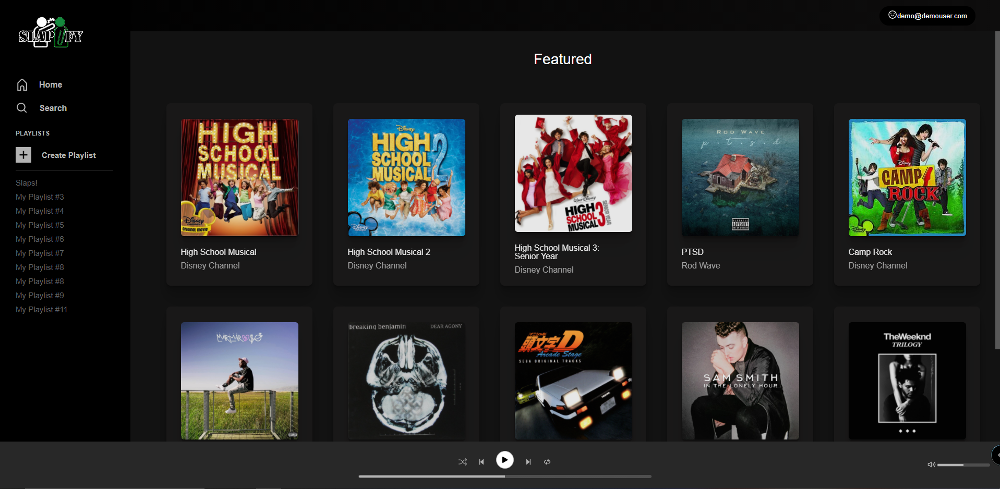
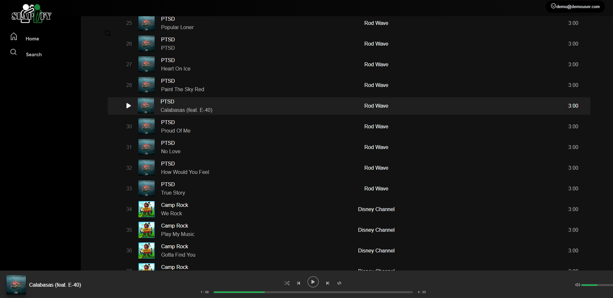

# Slapify
[Slapify](https://swong-slapify.herokuapp.com/?#/) is a [Spotify](https://open.spotify.com/) clone, where users are able to stream the latest music and get recommendations based on their music preference. Users are able to create and delete playlists as well as adding and removing songs from their owned playlists. Users are able to like albums as well as other user's playlists on the application allowing a social aspect to their streaming platform.

Slapify's backend is built using the Ruby on Rails framework with a PostgreSQL database, and AWS S3 storage for album art and music audio files. The frontend of the website is built with React.js and CSS3, utilizing Redux as to manage the front-end state. jQuery is used as the promise based HTTP client to make AJAX calls on the site.

## Features
* Browsing albums and songs
* Music player to play, mute, loop songs
* Search for songs that includes that match user input

## Technologies Used:
* React & Redux for frontend
* Ruby on Rails/PostgreSQL for backend
* Heroku for website hosting
* AWS S3 for media content storage

## Music Player:



* Built a music player from scratch:
  * Play song based on the current selected song.
    * Challenge: Using a single audio tag for multiple sources of audio files.
    * Solution: Keep track of the current song within the state, based on that song's audioUrl, play that song.
  * Implementing responsive playback and volume bars.
    * Challenge: Getting the correct values to translate to track's trail change of the slider's value based on the thumb's end point
    * Failed Solution: Using the song's beginning point to the thumb's end point value as the trail change color (green) and from the thumb to the end as the unchanged track trail color (grey).
    * Alternate Solution: Using percentages based on the whole number values of the beginning to thumb and thumb to end to determine the correct percentages to change background-color values of the slider.
    
* Implementation:
  * Music player:
  ``` jsx
    playMusic() {
    let songState = this.state.status;

    const audio = document.getElementById('audio');
    if(songState === 'playing') {
      clearInterval(this.interval);
      songState = 'paused'; 
      audio.pause();
    } else {
      songState = 'playing'; 
      audio.play();
      this.interval = setInterval(() => {
        this.scrub.value = this.audio.currentTime;
        this.scrub.style.background = 'linear-gradient(to right, #1DB954 0%, #1DB954 ' + ((this.scrub.value/this.scrub.max) * 100) + '%, #4e4e4e ' + ((this.scrub.value/this.scrub.max) * 100) + '%, #4e4e4e 100%)'
      }, 1000);
    };
    this.setState({ status: songState });
  };
   ```
The music player gets the song from props through the application state (currentSong in application state) and that song is the url that will be used as the source for the audio tag.

  * Volume and seeker sliders:
``` jsx
    <input
        ref={(scrub) => {
            this.scrub = scrub;
        }}
        type="range"
        min="0"
        max={this.audio ? this.audio.duration : "100"}
        onChange={this.handleScrub.bind(this)}
        className='bars'
        id='bars'
    />
    <input
        ref={(volume) => {
            this.volume = volume;
        }}
        type="range"
        min="0"
        max="1"
        step="0.02"
        onChange={this.handleVolume.bind(this)}
        className="bars"
        id='vol'
    />
```
Using HTML media's built in functions, we have access to the audio's duration and volume once there's a current song in the state to allow us to adjust the volume and seek through the track.
## Songs Search:



* Built a song's search from scratch:
  * Challenge: Choosing the filtering method to determine which songs to display as filter results.
  * Solution: Implementing a includes instead of a startsWith gives more results based on if the song includes the search query rather than it starting with which requires a more specific query.
  
* Implementation:
  * Handle change:
  ``` jsx
    handleChange(e) {
    const newSongs = this.props.songs.filter(song => 
        song.songName.toLowerCase().includes(e.target.value.toLowerCase())
      )
    this.setState({songs: newSongs})
  }
  ```
  The search will start with the state as all songs from the application passed down through props. This function will be passed to a onChange event to give a responsive search system.
  
  ## Future Features:
  
  * Add playlists for users
  * Add a liked songs and liked albums for the user
  * Add a queue to be able to play full albums
  * Add a user profile page
